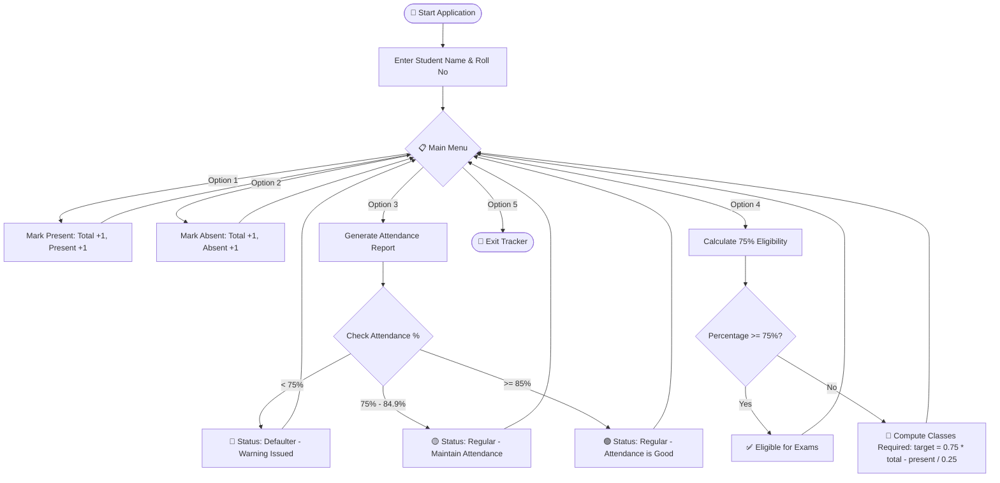

<div align="center">

# 🎓 Student Attendance Tracker

**A lightweight, intelligent command-line utility for tracking student attendance, monitoring attendance percentage, and computing 75% exam eligibility requirements in real-time.**

[](https://www.python.org/)
[](https://opensource.org/licenses/MIT)
[](https://github.com/aryan-mlhub/Student_Attendance_Tracker)
[](https://github.com/aryan-mlhub/Student_Attendance_Tracker)
[](https://github.com/aryan-mlhub/Student_Attendance_Tracker)

<br/>

[🚀 Quick Start](#-quick-start) •
[✨ Features](#-features) •
[📊 Workflow](#-system-workflow) •
[🖥️ Interactive Demo](#️-interactive-terminal-demos) •
[🧮 Eligibility Math](#-the-75-eligibility-formula) •
[🗺️ Roadmap](#-roadmap)

---

</div>

## 📖 Overview

Maintaining the mandatory **75% minimum attendance threshold** is crucial for academic eligibility. The **Student Attendance Tracker** is a streamlined Python tool designed to eliminate manual calculation errors. It lets students and instructors track sessions, identify defaulter status before exams, and calculate the exact number of consecutive classes needed to recover eligibility.

---

## ✨ Features

- ⚡ **Instant Attendance Logging**: Mark sessions as **Present** or **Absent** with a single keystroke.
- 📊 **Real-Time Analytics**: View real-time attendance percentage, total sessions, and current status.
- 🎯 **75% Eligibility Predictor**: Calculates how many consecutive upcoming classes a student must attend to hit or regain 75% attendance.
- ⚠️ **Defaulter Warning System**: Automated risk categorization based on attendance percentage.
- 🪶 **Zero External Dependencies**: Pure Python standard library—runs anywhere without `pip install`.

---

## 📊 System Workflow



---

## 🚀 Quick Start

### Prerequisites
Make sure you have [Python 3.x](https://www.python.org/downloads/) installed.

### 1. Clone the Repository
```bash
git clone https://github.com/aryan-mlhub/Student_Attendance_Tracker.git
cd Student_Attendance_Tracker
```

### 2. Run the Script
```bash
python attendance_tracker.py
```

---

## 🖥️ Interactive Terminal Demos

Click any section below to expand interactive walkthroughs and sample session outputs:

<details>
<summary>▶️ <b>1. Initialization & Marking Attendance</b></summary>
<br>

```text
===== Student Attendance Tracker =====
Enter student name: John Doe
Enter roll number: CS-101

===== Attendance Menu =====
1. Mark Present
2. Mark Absent
3. View Attendance
4. Check 75% Eligibility
5. Exit
Enter your choice: 1
Attendance marked as Present.

===== Attendance Menu =====
1. Mark Present
2. Mark Absent
3. View Attendance
4. Check 75% Eligibility
5. Exit
Enter your choice: 2
Attendance marked as Absent.
```
</details>

<details>
<summary>▶️ <b>2. Viewing Attendance Report & Status Evaluation</b></summary>
<br>

```text
===== Attendance Menu =====
1. Mark Present
2. Mark Absent
3. View Attendance
4. Check 75% Eligibility
5. Exit
Enter your choice: 3

----- Attendance Report -----
Student Name: John Doe
Roll Number: CS-101
Total Classes: 10
Present: 6
Absent: 4
Attendance Percentage: 60.0 %
Status: Defaulter
Warning: Attendance is below 75%.
```
</details>

<details>
<summary>▶️ <b>3. 75% Eligibility Recovery Calculator</b></summary>
<br>

```text
===== Attendance Menu =====
1. Mark Present
2. Mark Absent
3. View Attendance
4. Check 75% Eligibility
5. Exit
Enter your choice: 4

----- 75% Eligibility -----
Current Attendance: 60.0 %
You need to attend approximately 6 more classes to reach 75%.
```
</details>

---

## 🧮 The 75% Eligibility Formula

When attendance falls below 75%, the tracker calculates how many **consecutive future classes ($x$)** the student must attend to reach a $75\%$ attendance rate:

$$\frac{\text{Present} + x}{\text{Total} + x} \ge 0.75$$

Solving for $x$:

$$\text{Present} + x \ge 0.75(\text{Total} + x)$$

$$\text{Present} + x \ge 0.75 \cdot \text{Total} + 0.75x$$

$$0.25x \ge 0.75 \cdot \text{Total} - \text{Present}$$

$$x = \left\lceil \frac{0.75 \cdot \text{Total} - \text{Present}}{0.25} \right\rceil$$

---

## 📊 Status Matrix

| Attendance Range | Status Badge | Alert Level | Action Recommended |
| :--- | :---: | :---: | :--- |
| **$\ge 85\%$** | `🟢 Regular (Good)` | Low | Excellent record. Keep it up! |
| **$75\% - 84.9\%$** | `🟡 Regular` | Moderate | Caution: Do not miss upcoming sessions. |
| **$< 75\%$** | `🔴 Defaulter` | **High** | Critical: Must attend required classes to qualify. |

---

## 🗺️ Roadmap

- [x] Student profile setup (Name & Roll Number)
- [x] Basic Present/Absent counter
- [x] Dynamic percentage calculation & Defaulter flags
- [x] 75% recovery class calculation formula
- [ ] 💾 Multi-student persistent storage (JSON / SQLite)
- [ ] 📅 Date & timestamp logging per session
- [ ] 📤 Export attendance reports as CSV / PDF
- [ ] 🎨 Graphical User Interface (Tkinter / CustomTkinter / Web UI)

---

## 🤝 Contributing

Contributions, issues, and feature requests are welcome! Feel free to check the [issues page](https://github.com/aryan-mlhub/Student_Attendance_Tracker/issues).

1. **Fork** the repository
2. **Create** your feature branch (`git checkout -b feature/AmazingFeature`)
3. **Commit** your changes (`git commit -m 'Add some AmazingFeature'`)
4. **Push** to the branch (`git push origin feature/AmazingFeature`)
5. **Open** a Pull Request

---

## 📝 License

Distributed under the MIT License. See `LICENSE` for more information.

---

<div align="center">

Made with ❤️ by [Aryan](https://github.com/aryan-mlhub)

⭐ If you found this useful, please consider giving it a star! ⭐

</div>